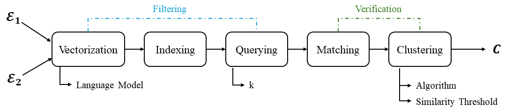

<div align="center">
    <br><b><h1>Auto-Configuring Entity Resolution Pipelines</h1></b>
</div>

<div align="center" style="font-size:20px; font-weight:bold;">
    Konstantinos Nikoletos<sup>1</sup>, 
    Vasilis Efthymiou<sup>2</sup>, 
    George Papadakis<sup>3</sup>, 
    Kostas Stefanidis<sup>4</sup>
</div>

<div align="center" style="font-size:14px; font-weight:normal; margin-top:6px;">
    <sup>1</sup>National and Kapodistrian University of Athens, Greece (<i>k.nikoletos@di.uoa.gr</i>)<br>
    <sup>2</sup>Harokopio University of Athens, Greece (<i>vefthym@hua.gr</i>)<br>
    <sup>3</sup>National and Kapodistrian University of Athens, Greece (<i>gpapadis@di.uoa.gr</i>)<br>
    <sup>4</sup>Tampere University, Finland (<i>konstantinos.stefanidis@tuni.fi</i>)
</div>


---

## Overview

Entity Resolution (ER) is the task of identifying and linking different descriptions of the same real-world entity (e.g., a person, product, publication, or location) across diverse datasets. While ER is essential for improving data quality and enabling downstream applications such as analytics and machine learning, building an effective ER pipeline is far from trivial.  

An end-to-end ER workflow typically consists of multiple steps — such as **blocking**, **similarity estimation**, and **clustering** — each of which requires careful selection and tuning of algorithms and parameters. The search space for possible configurations is enormous, and the performance of a given pipeline is highly sensitive to these choices. Traditionally, this tuning process has been manual, time-consuming, and dependent on the availability of ground truth labels, making ER both labor-intensive and error-prone.

This project tackles the challenge by introducing **Auto-Configuring Entity Resolution Pipelines**, a framework that leverages **pre-trained language models** and **AutoML techniques** to automatically configure efficient, high-performing ER workflows. The framework addresses two key scenarios:

1. **Ground-Truth Aware Auto-Configuration**  
   When a portion of ground truth matches is available, we frame parameter tuning as a hyperparameter optimization problem. By integrating **sampling-based search techniques** (e.g., Random, TPE, QMC, Bayesian optimization), our approach drastically reduces the number of trials needed to approximate the optimal configuration, achieving near-optimal effectiveness in **orders of magnitude less time** compared to exhaustive grid search.

2. **Ground-Truth Agnostic Auto-Configuration**  
   When no ground truth is available, we introduce a **regression-based approach** that predicts the effectiveness of pipeline configurations. Using dataset profiling features and configurations from other datasets with ground truth, we train models (Random Forest and AutoML ensembles) to generalize and recommend effective configurations for unseen datasets.

<div align="center">
    
  <br>Figure 1: End-to-End ER (ETEER) pipeline leveraged by AutoER.
</div>

### Key Contributions
- **Problem Definition:** Formalization of two novel ER problems — automatic pipeline configuration *with* and *without* ground truth — not previously explored in ER research.  
- **Sampling for ER:** First application of hyperparameter optimization methods (Random, TPE, QMC, Bayesian search) to ER pipelines, demonstrating they can achieve near-optimal F1 with only a fraction of the search cost.  
- **Regression-Based Auto-Configuration:** First regression-based solution for ER configuration without ground truth, leveraging dataset features and supervised learning to predict effective pipeline setups.  
- **Extensive Evaluation:** Empirical results on **11 real-world benchmark datasets** show that the proposed approaches consistently balance high effectiveness with significant runtime efficiency.  
- **Open-Source Implementation:** The framework is released openly to foster reproducibility and further research in automated ER.  


# Repository Structure

- `data/` – datasets used in experiments.  
- `figures/` – figures from the paper (pipeline, results, etc.).  
- `sheets/` – CSV and spreadsheets with experimental results.  
- `with_gt/` – code & scripts for **Problem 1** (auto-config with ground truth).  
- `without_gt/` – code & scripts for **Problem 2** (auto-config without ground truth).  
- `baseline/` – replication of ZeroER & DITTO baselines.  
- `benchmarking/` – scalability evaluation on DBpedia.  
- `results.ipynb` – notebook to generate figures and tables.  

# Datasets

Please in the initial directory execute commands to download and prepare datasets:

```
chmod +x prepare_datasets.sh
./prepare_datasets.sh
```

# Problem 1: **With** Ground-Truth file

## Build

Create conda env:

```
conda env create -f autoconf_env_p1_p2.yml
conda activate autoconf_p1_p2
```

## Execution

Go to `/with_gt/scripts/` and run 

```
nohup ./run_exps.sh 2>&1 & 
```

in the end a concatenation is made to get the files in the appropriate format. 

# Problem 2: **Without** Ground-Truth file

## AutoML Approach

### Build

Create conda env:

```
conda env create -f autoconf_env_automl.yml
conda activate autoconf_automl
```

### Execute

To run one experiment:
```
python -u regression_with_automl.py --trials_type $t --hidden_dataset $d --config $config_file
```

where:
- `--trials_type` stands for training instances type
- `--hidden_dataset` stands for training with Di..j and holding Dx us hidden for testing
-  `--config` specifies experiment type

To run all one-by-one:
```
nohup ./automl_exps.sh ./automl/configs/12_4_0.json > ./automl/logs/EXPS_12_4_0.log  2>&1 &\n
```

the config file specifies experiments characteristics, like overall/per model hours for auto-sklearn, etc. 

and in the end, you need to conactenate all results into a format that can be read by the notebook, for merging purposes. 

Execute:

```
python concatenate.py --exp 12_4_0
```

where `--exp` stands for the experiment name executed before.

## Regression


### Build

Create conda env:

```
conda env create -f autoconf_env_p1_p2.yml
conda activate autoconf_env_p1_p2
```

### Execute

To run one experiment:
```
python -u regression_with_sklearn.py --trials $dataset --regressor "LINEAR"
```

where:
- `--trials` stands for training instances type

To run all one-by-one:
```
nohup ./sklearn_exps.sh > sklearn_exps.log 2>&1 &
```

## Merging all results into common files

After all experiments have finished, run:

```
python concatenate_exps.py
```

and you're ready!

# Scalability tests on DBpedia dataset

## Using AutoML approach

Executing this will create the top-1 workflow suggested per training trials type for DBPedia.
```
nohup ./run_dbpedia_exps.sh > ./logs/dbpedia.log  2>&1 &
```

## Using Regression approach

Create predictions for all instances:

```
python eteer_evaluate_ind_regressors.py --config ./configs/D1D10_DBPEDIA_ALL_LinearRegression.json
python eteer_evaluate_ind_regressors.py --config ./configs/D1D10_DBPEDIA_OPTUNA_LinearRegression.json
python eteer_evaluate_ind_regressors.py --config ./configs/D1D10_DBPEDIA_GRIDSEARCH_LinearRegression.json
```

where:
- `--config` stands for the experiment specifications (these configs are included). For example `D1D10_DBPEDIA_ALL_LinearRegression.json`, title stands for train in D1...D10 test in DBPEDIA, use all trials instances, and Linear Regression.


## Evaluating the prediction to get the real F1 (applies to both types of training)

For AutoML:
```
 ./eval_dbpedia_exps.sh
```

or for LR:

```
nohup python -u evaluate.py --confcsv ./results/D1D10_DBPEDIA_{$TYPE}_LinearRegression.csv  --datajson ./configs/data/dbpedia.json > ./logs/D1D10_DBPEDIA_LR.log 2>&1 &
```

same for `{$TYPE} = ALL, OPTUNA, GRIDSEARCH`

where:
-  `--confcsv`: is used in a similar way as before
-  ` --datajson`: contains the needed information of the dataset that will be evaluated

# Baseline

## ZeroER

1. Go to `cd ./baselines`
2. Create conda env
    1. `conda env create -f environment.yml`
    2. `conda activate ZeroER`
4. Run all exps `./run.sh ./logs`

## DITTO

Downloading NVIDIA container toolkit:
```
chmod +x nvidia_installation.sh
./nvidia_installation.sh
```

Creating the environment:
```
sudo docker build -t ditto ditto
```

Configuration:
```
CUDA_VISIBLE_DEVICES=0 python train_ditto.py --task AutoER/D2  --batch_size 16 --max_len 256 --lr 3e-5 --n_epochs 5 --lm roberta --fp16 --da del --dk product --summarize
```

Blocks for DITTO created in ready_for_ditto_input directory, using:
```
transform_all_for_ditto.sh
```
and more specifically:
```
python blocking.py --datajson '../../data/configs/D2.json'
```

where datajson is the configuration file for the dataset.


Moving files inside docker container:
```
docker cp ./configs.json acc70a93a256:/workspace/ditto     
docker cp ./ready_for_ditto_input/ acc70a93a256:/workspace/ditto/data/./ready_for_ditto_input/  
docker cp ./train_ditto.py acc70a93a256:/workspace/ditto
docker cp ./run_all_inside.sh 54d79d32d83d:/workspace/ditto
``` 

Entering docker:
```
sudo docker run -it --gpus all --entrypoint=/bin/bash ditto       
```

Inside docker:
```
cd /workspace/ditto
mkdir logs
chmod +x run_all_inside.sh
nohup ./run_all_inside.sh > nohup.out 2>&1 & 
```

Results will be in `./workspace/ditto/logs/`.

# Resources

| Spec    | Exp. P1 & P2                             | Exp. P2 - AutoML                                                   |
|---------|------------------------------------------|--------------------------------------------------------------------|
| OS      | Ubuntu 22.04 jammy                       | Ubuntu 22.04 jammy                                                 |
| Kernel  | x86_64 Linux 6.2.0-36-generic            | x86_64 Linux 6.5.0-18-generic                                      |
| CPU     | Intel Core i7-9700K @ 8x 4.9GHz [46.0°C] | Intel Xeon E5-4603 v2 @ 32x 2.2GHz [31.0°C]                        |
| GPU     | NVIDIA GeForce RTX 2080 Ti               | Matrox Electronics Systems Ltd. G200eR2                            |
| RAM     | 6622MiB / 64228MiB                       | 4381MiB / 128831MiB                                                |
